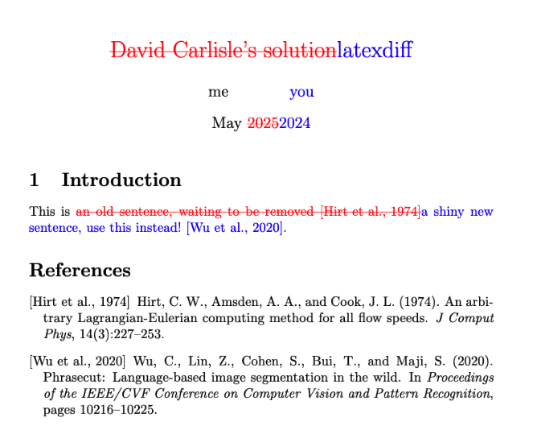

# Latexdiff Tutorial

[Latexdiff](https://ctan.org/pkg/latexdiff?lang=en) shows highlights the difference betweent two latex documents. Follow these steps:  

1. In the project directory, flatten latex files into two copies: `pre.tex` and `post.tex`.
2. Run this in terminal: `latexdiff pre.tex post.tex > diff.tex`
    - Choose a different style with latexdiff -t [OPTION]
    A `diff.tex` file will be generated.
3. Open `diff.tex` in local Latex Editor (e.g. Texifier), make changes if needed.
    - You can override sytles at the end of the preamble. For example, to remove curly underlines for added text in the defualt `UNDERLINE` style, You can do so by inserting the following lines at the end of the preamble: 
	```latex
	\renewcommand{\DIFadd}[1]{\textcolor{blue}{#1}}  
	\renewcommand{\DIFaddbegin}{}  
	\renewcommand{\DIFaddend}{} 
	```
4. Compile `diff.tex` to PDF.
Latexdiff will generate a PDF that looks something like this:


## Overleaf
Steps 1-2 can be done in Overleaf, with one additional step: under root directory, create a file called `latexmkrc` with the following content:  
```
$pdflatex = "latexdiff pre.tex post.tex > main-d.tex; pdflatex %O  main-d"
```
This will automatically generate `diff.tex` when you compile the project.

## Resources
- [Latexdiff Manual](resources/manual.pdf)